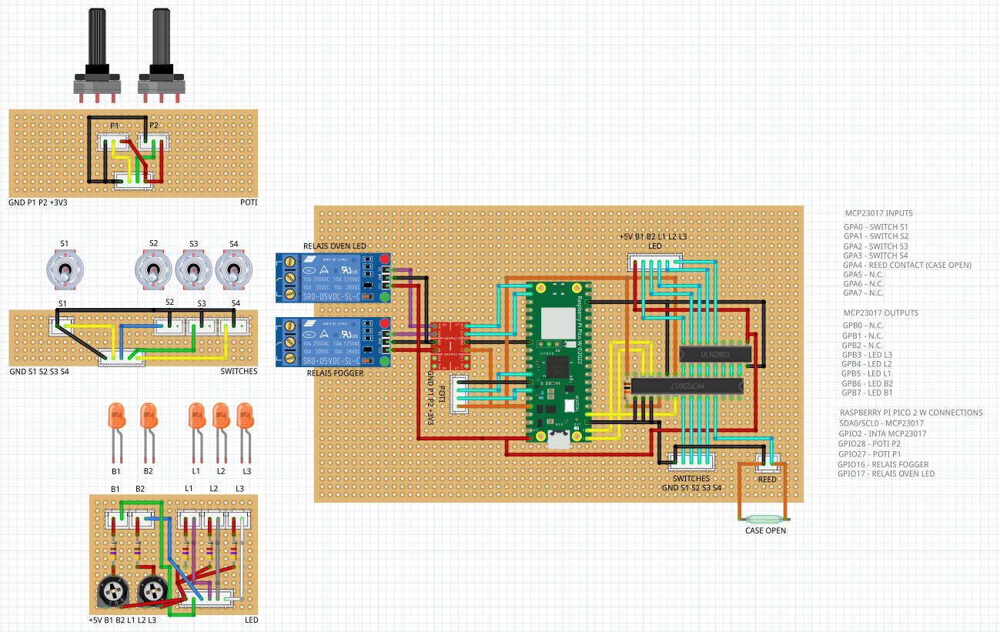

# Dr. Moratorius' SteamPack

**Last Update: 2025-02-13**

This is a repository explaining how I built my steam pack and also provide 
all of the required files and information.
Please note that this is more a repository that can help you build your own
or adapt it and not a full tutorial.

## Features
* Powered by USB (power bank)
* Powered by Raspberry Pi Pico 2 W using MicroPython
* Wooden Backpack
* Sounds
* Timed steam (ultrasonic fogger) output with corresponding supporting steam sound
* Sounds when turning on and off certain parts (choose from 255 MP3 files on SD card!)
* and more!

## Electronics Setup

_Please note that this [Fritzing](https://fritzing.org/) layout does not yet contain the sound board!_
* [Raspberry Pi 2 Pico 2 W](https://www.raspberrypi.com/products/raspberry-pi-pico-2/)
* [MCP23017](https://www.microchip.com/en-us/product/mcp23017) (I²C) for handling switch inputs and LED, fogger and "fire" LED utilizing [ULN2803A](https://www.st.com/resource/en/datasheet/uln2804a.pdf) for switching the higher currents
* [MCP23017](https://www.microchip.com/en-us/product/mcp23017) (I²C) and sound board [DY-SV5W](https://grobotronics.com/images/companies/1/datasheets/DY-SV5W%20Voice%20Playback%20ModuleDatasheet.pdf) to play up to 255 different MP3 files from SD card
* separate potentiometer and switch and LED boards for easier placement inside box
* LED board includes potentiometers for setting the intensity
* fogger and LED "fire" switched via relay to enable usage of multiple powerbanks to keep main circuit powered even after draining the fogger or "fire" LED battery
* utilizes level shifters for handling 5V connected to 3V3 ports (relays, sound board)

## Components
* [parts list](docs/PARTS.MD)
* [labels (DOCX)](docs/Schilder.docx)
* [vial holder outer part pattern](docs/Schnittmuster.pdf) - print 100% (do not resize to printer edges) - does not fully cover outer part, but sufficient
* 3D printer files
  * [Vial holder (left) - STL](3d/Moratorius_Steampack_Vial_Holder_R.stl) 
  * [Vial holder (right) - STL](3d/Moratorius_Steampack_Vial_Holder_R.stl)
  * [Vial holder (left) - GCODE for Anycubic i3 MEGA](3d/AIM/AIM_Moratorius_Steampack_Vial_Holder_L.gcode)
  * [Vial holder (right) - GCODE for Anycubic i3 MEGA](3d/AIM/AIM_Moratorius_Steampack_Vial_Holder_R.gcode)
* [Fritzing breadboard layout](fritzing/DrMoratorius-SteamPack-Breadboard.fzz) - still missing schematic and audio part 

## Software
* The code uses the latest MicroPython download from https://www.raspberrypi.com/documentation/microcontrollers/micropython.html
* The source code is available in the `src` directory and still WIP!
* It loads most of the configuration from the `config.json` file, but some parts are (still) hardcoded
* Potential ideas for the future: allow control via smartphone through a WiFi AP

## Sounds
The used sound module [DY-SV5W](https://grobotronics.com/images/companies/1/datasheets/DY-SV5W%20Voice%20Playback%20ModuleDatasheet.pdf?1559812879320) is using an
SD card (32 GB max, FAT32) with several sounds mixed from available sounds online. Here is a selection:
* https://freesound.org/people/qubodup/sounds/194882/
* https://freesound.org/people/qubodup/sounds/395041/
* https://freesound.org/people/mike_stranks/sounds/407394/
* https://freesound.org/people/craigsmith/sounds/438641/
* https://freesound.org/people/theshaggyfreak/sounds/440453/
* https://freesound.org/people/stib/sounds/487748/
* https://freesound.org/people/Engineer_815/sounds/493558/ (main steam sound used)
* https://freesound.org/people/rottako/sounds/693587/
* https://freesound.org/people/qubodup/sounds/752067/
* https://www.youtube.com/watch?v=LwiOCsfa_ZA (gear sounds)
* https://freesound.org/people/Vibratair/sounds/403892/ (electricity)
* https://freesound.org/people/Halleck/sounds/19487/ (electricity)
* https://freesound.org/people/Vibratair/sounds/403892/ (electricity)
* https://freesound.org/people/opyate/sounds/518945/ (on/off sound - off = reverted)

## How To Build
Please see the [HOWTO](HOWTO.MD)

## Partical Notes
If you use a power bank please keep in mind that most turn off completely if the attached device
does not use a lot of power requiring you to open the case and turn on the powerbank again.
For the future using 18650 cells (with additional protection circuit) with corresponding
charging board might be an option.

